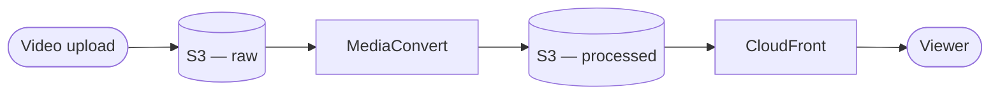
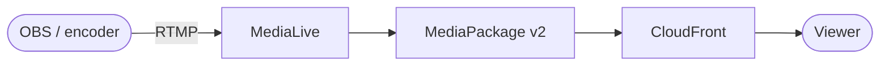
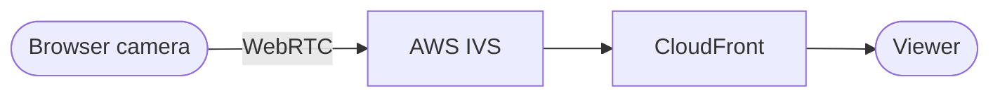

# yao_streaming

A video platform combining on-demand video (upload, transcode, catalog, watch) with two independent ways to broadcast live — from a dedicated encoder or straight from a browser. Java Spring Boot, MySQL, Docker, Kubernetes (EKS), Terraform-managed AWS infrastructure. Developed with the help of [Claude Code](https://claude.com/claude-code).

## What the platform does

| Capability | Summary |
|---|---|
| Upload & catalog | Users upload video, browse a catalog of finished videos, and watch them. |
| On-demand transcoding | Uploaded video is automatically converted into a browser-playable, adaptively-deliverable format. |
| Live broadcast (encoder) | A streamer runs OBS (or similar) and broadcasts to a fixed pool of managed live-video channels. |
| Live broadcast (browser) | A streamer goes live directly from a browser tab — camera and microphone, no external software. |
| Unified live catalog | Viewers see every currently-live broadcast in one place, regardless of which broadcast mechanism produced it. |

## Tech stack

- **Language & framework**: Java, Spring Boot (Spring MVC, Spring Security, Spring Data JPA, Spring Session JDBC)
- **View layer**: Thymeleaf (server-rendered), hls.js, AWS IVS Broadcast SDK for Web
- **Database & migrations**: MySQL, Flyway
- **Testing**: JUnit, Testcontainers
- **Containers & orchestration**: Docker, Docker Compose, Kubernetes (EKS)
- **Infrastructure as code**: Terraform
- **AWS services**: S3, CloudFront, RDS, EKS, ECR, ALB, IAM/IRSA, Lambda, EventBridge, MediaConvert, MediaLive, MediaPackage v2, AWS IVS
- **AI-assisted development**: Claude Code

## Three content paths

VOD and both live-streaming mechanisms are genuinely independent end to end — separate AWS services, separate protocols, separate confirmation pipelines — but they all reach the viewer through the same CloudFront-fronted playback experience. A viewer never needs to know or care which path produced what they're watching.

The three diagrams below are deliberately extremely simplified — just the main hop through each pipeline, not the app's own request handling, status transitions, or the asynchronous confirmation steps behind them. Each links to a page with the real, detailed flow.

**VOD** — see [VOD](docs/guide/vod.md)

**Live — RTMP (encoder)** — see [Live Streaming: RTMP](docs/guide/live-streaming-rtmp.md)

**Live — WebRTC (browser)** — see [Live Streaming: WebRTC](docs/guide/live-streaming-webrtc.md)

## Contents

- **[VOD](docs/guide/vod.md)** — upload, transcode, catalog, and watch for pre-recorded video.
- **[Live Streaming: RTMP](docs/guide/live-streaming-rtmp.md)** — broadcasting from OBS (or any RTMP encoder) into a managed channel pool.
- **[Live Streaming: WebRTC](docs/guide/live-streaming-webrtc.md)** — broadcasting straight from a browser's camera, no encoder required.
- **[Data Model](docs/guide/database.md)** — the schema and entity-relationship diagram behind everything else in this guide.
- **[Protocols, Codecs, and Transcoding](docs/guide/protocols-and-codecs.md)** — the shared vocabulary (codecs, ingest protocols, HLS, latency) used across every pipeline above.
- **[Infrastructure](docs/guide/infrastructure.md)** — the AWS architecture: networking, compute, identity, and the live-streaming resource pools.
- **[Local Development](docs/guide/local-development.md)** — running and testing the platform with Docker, no AWS account needed.
- **[Deployment](docs/guide/deployment.md)** — required tools, AWS account/permissions, and the commands to provision and deploy.
- **[Future Improvements](docs/guide/future-improvements.md)** — known gaps and natural next steps.

## Where to start reading

Want to run this yourself? Start with [Local Development](docs/guide/local-development.md). Otherwise, start with whichever feature page matches what you're investigating — [VOD](docs/guide/vod.md), [Live Streaming: RTMP](docs/guide/live-streaming-rtmp.md), or [Live Streaming: WebRTC](docs/guide/live-streaming-webrtc.md) — each links out to [Data Model](docs/guide/database.md) and [Protocols, Codecs, and Transcoding](docs/guide/protocols-and-codecs.md) for background as it comes up, so there's no need to read those two first.
