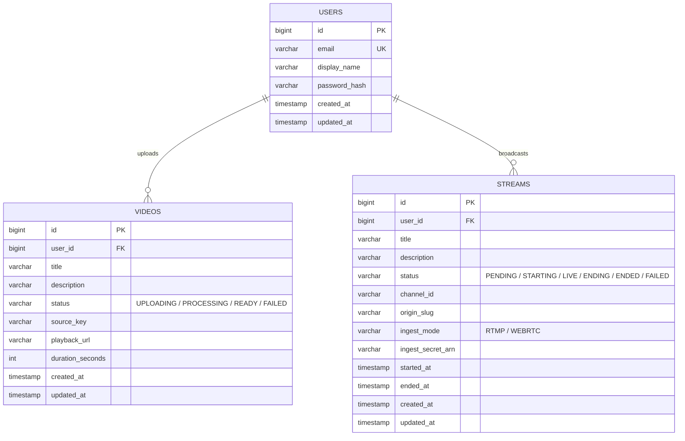

# Data Model

Three domain tables back the entire platform: users, uploaded videos, and live streams. Session state is stored server-side in its own pair of tables rather than in-memory, so any application instance can serve any logged-in user's request.

## Entity-relationship diagram

Both `videos.user_id` and `streams.user_id` are `NOT NULL` foreign keys with `ON DELETE RESTRICT` / `ON UPDATE RESTRICT` — a user with any videos or streams on record can't be deleted out from under that history.

## `users`

The account table backing authentication. `password_hash` is never serialized in API responses. Nothing else in the schema references `users` beyond the two ownership foreign keys above — there's no profile, follower graph, or role table.

## `videos`

One row per uploaded video.

| Column | Notes |
|---|---|
| `status` | Lifecycle enum, see below. Indexed, since the catalog page filters on it. |
| `source_key` | The raw (pre-transcode) object's S3 key. |
| `playback_url` | Set once transcoding finishes; null until then. |
| `duration_seconds` | Populated best-effort during transcoding; can be null if probing failed. |

**`VideoStatus`**: `UPLOADING` → `PROCESSING` → `READY`, with `FAILED` reachable from either in-progress state. A freshly-created row starts `UPLOADING`; `PROCESSING` is only ever entered on the transcoding path that runs in-process locally (the fully-offloaded pipeline used against real AWS jumps straight from `UPLOADING` to `READY`/`FAILED`, since nothing in the app itself claims the row while MediaConvert does the work — see [VOD pipeline](vod.md)).

## `streams`

One row per live broadcast (a completed stream is a row, not a deleted one — history is kept, not archived elsewhere).

| Column | Notes |
|---|---|
| `status` | Lifecycle enum, see below. |
| `channel_id` | The currently- or last-bound pool channel's ARN. Deliberately **not** a foreign key — the pool of channels is infrastructure-managed configuration, not a table in this schema — and deliberately not cleared when a stream ends, so the binding stays visible for later reference. |
| `origin_slug` | The pool slot's CDN path segment (e.g. `pool-0`), set once a channel is claimed. |
| `ingest_mode` | Set once at creation and never changed afterward — decides which channel pool and which playback URL convention this stream uses. |
| `ingest_secret_arn` | Only ever set for `WEBRTC` streams (the bound stream key's ARN); always null for `RTMP` streams, which carry their per-claim secret in the ingest URL itself instead. |

**`StreamStatus`**: `PENDING` (row created, no channel reserved yet — a stream can sit here indefinitely if every pool slot is busy, with no other side effect) → `STARTING` (a channel has been claimed and the client has an ingest URL/key, but the broadcast hasn't been confirmed live yet) → `LIVE` (confirmed actually broadcasting) → `ENDING` (a stop has been requested, awaiting confirmation) → `ENDED`. `FAILED` is reachable from `STARTING` if reserving a channel fails outright. The three statuses `STARTING`, `LIVE`, and `ENDING` are collectively what "currently holds a pool channel slot" means — a new stream can never claim a channel that any other stream currently holds in one of those three states.

**`IngestMode`**: `RTMP` (OBS-style push into a MediaLive/MediaPackage pool — see [RTMP live streaming](live-streaming-rtmp.md)) or `WEBRTC` (browser camera capture into an AWS IVS pool — see [WebRTC live streaming](live-streaming-webrtc.md)).

## Session storage

A standard two-table session store (one row per active session, one row per session attribute, cascade-deleted together) backs login state, so sessions survive an application restart or a request landing on a different pod than the one that created it.

---

[← Home](../../README.md) · Next: [Protocols, Codecs, and Transcoding](protocols-and-codecs.md)
