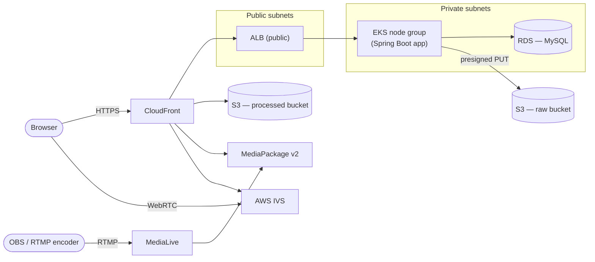
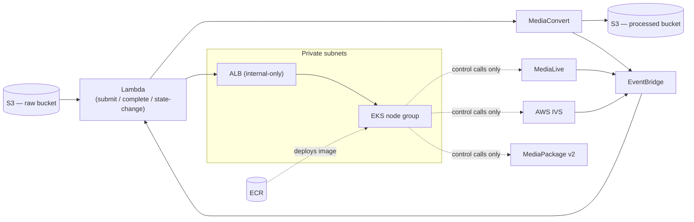

# Infrastructure

The AWS architecture behind the platform. For how to actually provision and deploy this, see [Deployment](deployment.md).

## Overview

Two ideas run through this layout, and the two diagrams below split cleanly along the first one:

- **Control plane / data plane split.** The Spring Boot application only ever issues URLs and short-lived control calls (start/stop a MediaLive channel, mint an IVS stream key) — actual video bytes flow directly between the browser, S3, MediaConvert, MediaLive/MediaPackage v2, and AWS IVS, never through the application itself. This holds for uploads, MediaConvert output, and both live-streaming mechanisms alike, and is why the application can stay a single small instance regardless of how much video moves through the platform.
- **Public vs. internal ingress.** Two separate ALBs front the same application: a public one for ordinary browser traffic, and a second, internal-only one reachable exclusively by the Lambda functions in the second diagram below — so the callback endpoints those functions call have no public network path to them at all, and need no application-level authentication of their own as a result. CloudFront itself proxies the *entire* application, not just video paths — its own signed cookies can only ever be sent back to the domain that set them, so the login/catalog/watch pages and the video/manifest paths all have to share one domain.

### Data plane — requests, uploads, and playback

Every video byte — an upload, a MediaConvert output, an RTMP or WebRTC broadcast — flows along one of these paths, never through the application. The application (`EKS`) only ever handles page requests, API calls, and handing out a presigned upload URL.

### Control plane — processing, async confirmation, and deploys

This is the machinery behind the "accept, then confirm" pattern both live-streaming mechanisms and MediaConvert use (see [Event-driven confirmation](#event-driven-confirmation) below): a Lambda function starts something, a separate EventBridge event confirms it actually happened, and a second Lambda calls back into the application over the internal-only ALB. `EKS`'s own outbound calls into MediaLive/IVS/MediaPackage are deliberately narrow, short control calls (start/stop, mint a key, reset state) — never a video byte among them.

## Networking

A single VPC spans two availability zones for redundancy. Public subnets hold the public ALB and NAT egress; private subnets hold the EKS node group, RDS, and the internal-only ALB, with RDS's inbound access restricted to the EKS cluster's own security group and nothing else.

## Compute and data

- The application runs as a container on an EKS managed node group, fronted by both ALBs described above, with a readiness/liveness health check and an init container that waits for RDS to become reachable before starting.
- A single RDS MySQL instance backs the schema described in [Data Model](database.md).
- Two S3 buckets exist — `raw` for uploads, `processed` for MediaConvert/MediaLive output — both fully private, with the `processed` bucket reachable only through CloudFront's Origin Access Control, never a public bucket policy.
- ECR holds the application's built container image.

## Identity and access

The application authenticates to every AWS service it calls through IRSA (IAM Roles for Service Accounts) — a role tied to its own Kubernetes ServiceAccount, with no long-lived AWS credentials stored anywhere in the deployment. Its permissions are scoped narrowly to exactly the calls the code actually makes:

| Service | Permissions granted |
|---|---|
| S3 | `GetObject`/`PutObject` on the raw and processed buckets only |
| MediaLive | `StartChannel`/`StopChannel`/`DescribeChannel`, plus `UpdateInput` (ingest-secret rotation) |
| MediaPackage v2 | `ResetOriginEndpointState` only |
| AWS IVS | `CreateStreamKey`/`DeleteStreamKey`/`ListStreamKeys`/`StopStream` |

No `Create*`/`Delete*` rights on MediaLive or IVS channels themselves — both channel pools are fixed by Terraform, never provisioned or torn down by the application at runtime. This is a separate, much narrower identity from whatever credentials actually run `terraform apply` — see [Deployment](deployment.md#aws-account-and-permissions) for that side.

## Event-driven confirmation

Both live-streaming mechanisms, and the MediaConvert pipeline, share the same shape: a request that starts or stops something (`StartChannel`, `CreateStreamKey`, `CreateJob`) returns immediately, and a separate EventBridge event — emitted once the underlying AWS service's real state actually changes — triggers a Lambda function that calls back into the application over the internal ALB. This is why the platform needs EventBridge and a small set of purpose-built Lambda functions rather than the application polling AWS for status itself.

## Live-streaming resource pools

Two independent, fixed-size pools exist side by side:

- **MediaLive + MediaPackage v2** — one MediaLive RTMP-ingest channel per pool slot, each feeding a MediaPackage v2 channel/origin-endpoint for HLS packaging. See [RTMP live streaming](live-streaming-rtmp.md).
- **AWS IVS** — one IVS Low-Latency Streaming channel per pool slot, accepting either RTMPS or WebRTC ingest on the same channel. See [WebRTC live streaming](live-streaming-webrtc.md).

Both pools are pre-provisioned entirely by Terraform; the application only ever claims, starts, and stops slots within them, never creates or deletes the slots themselves.

---

[← Home](../../README.md) · Next: [Local Development](local-development.md)
