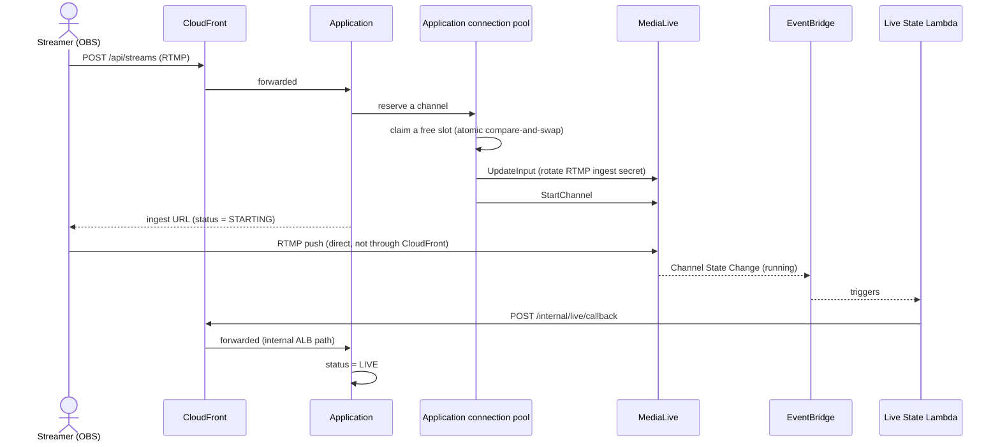
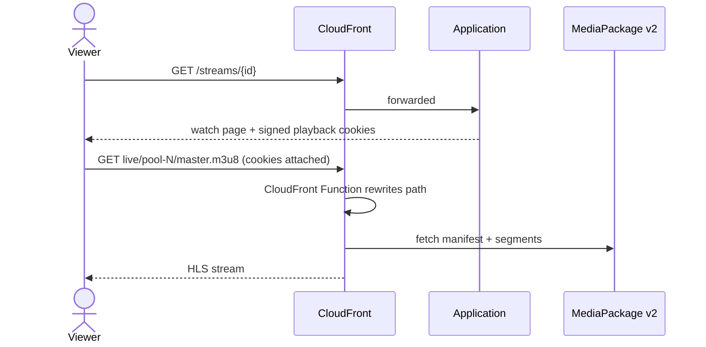
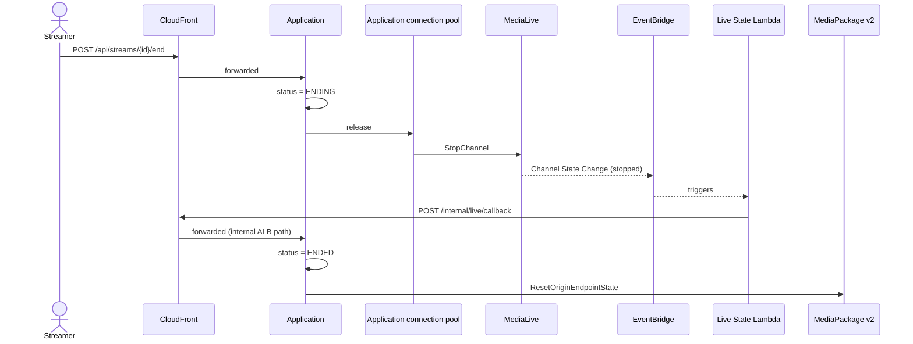

# Live Streaming: RTMP (Encoder Broadcast)

Broadcasting from a dedicated encoder (OBS or any RTMP-capable software) into a fixed pool of AWS MediaLive channels. Background: [Protocols, Codecs, and Transcoding](protocols-and-codecs.md), [Data Model](database.md#streams).

Every request shown below as `Streamer`/`Viewer` → `Application` actually passes through CloudFront first — CloudFront proxies the entire application, not just video playback (see [Infrastructure](infrastructure.md)). It's omitted from most diagram lanes below only to keep them readable.

## The channel pool

Rather than provisioning a MediaLive channel per broadcaster on demand, a small, fixed-size pool of channels is provisioned once by Terraform and reused across every stream over time. Going live means *claiming* one of these pre-existing channels for the duration of a broadcast, not creating anything new. A database-level compare-and-swap keeps two broadcasters from ever being handed the same channel at once: claiming a channel is a single atomic MySQL update that only succeeds if no other currently-active stream already holds it, so concurrent go-live requests racing for the same slot resolve safely without any extra locking layer.

Each MediaLive channel is paired with a MediaPackage v2 channel/origin-endpoint, which turns the encoder's incoming RTMP feed into an HTTP-playable HLS output — MediaLive handles the actual transcoding, MediaPackage v2 handles turning that into segments and a manifest.

## Going live

The ingest URL handed back to the streamer isn't a static, permanently-reusable address — its secret is rotated on every single claim, before the channel is started, via MediaLive's `UpdateInput`. That means a previous broadcaster's ingest URL for that same pool slot stops working the moment someone else claims it, rather than staying valid indefinitely. The RTMP push itself goes directly from OBS to MediaLive — this one connection is the only part of the whole flow that doesn't pass through CloudFront, since it's a raw encoder protocol, not HTTP.

`StartChannel` is an accept-and-return call: it returns immediately, before the channel is actually confirmed running. The application only marks a stream genuinely `LIVE` once an asynchronous confirmation arrives — MediaLive emits a channel-state-change event on EventBridge once it's confirmed running, a Lambda function reacts to that event, and calls back into the application over the internal-only ALB path. This two-step "accepted, then confirmed" pattern (rather than trusting `StartChannel`'s initial response as proof of a live broadcast) is what makes the status genuinely reflect reality even though starting a channel takes real time.

## Playback

Every pool slot's MediaPackage v2 output lives at a fully deterministic path, so a CloudFront Function rewrites the clean, pool-slot-based URL the viewer requests into that real path — this keeps the live-streaming URL convention independent of MediaPackage's own internal path structure. Playback authorization uses the same CloudFront signed-cookie mechanism as VOD, scoped to the live path instead. Because every part of a live manifest and its segments stays on this same CloudFront-fronted MediaPackage origin (unlike the WebRTC path — see [WebRTC live streaming](live-streaming-webrtc.md#playback-and-why-its-different)), the signed cookie alone is a complete gate here.

## Ending a stream

`StopChannel` happens immediately when "End Stream" is pressed, but MediaPackage v2's leftover state is only cleared out (`ResetOriginEndpointState`) *after* the asynchronous stop confirmation lands — clearing it any earlier risks a race where a few trailing segments from the ending broadcast slip into a manifest that's just been reset, momentarily serving stale content to viewers. The same accept/confirm pattern used for going live governs ending a stream too.

---

[← Home](../../README.md) · Next: [Live Streaming: WebRTC](live-streaming-webrtc.md)
