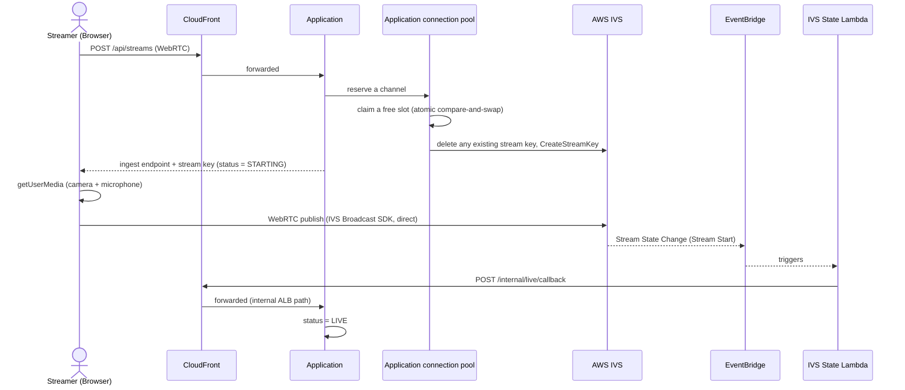
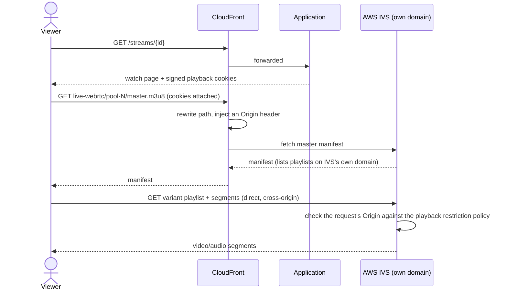
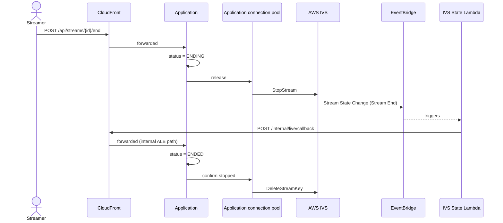

# Live Streaming: WebRTC (Browser Broadcast)

Broadcasting straight from a browser's camera and microphone into a fixed pool of AWS IVS channels — no external encoder required. A second, independent way to go live that coexists with [RTMP live streaming](live-streaming-rtmp.md) rather than replacing it: a streamer picks one mechanism per broadcast, and viewers watch either kind through the same catalog and watch pages. Background: [Protocols, Codecs, and Transcoding](protocols-and-codecs.md), [Data Model](database.md#streams).

Every request shown below as `Streamer`/`Viewer` → `Application` actually passes through CloudFront first — CloudFront proxies the entire application, not just video playback (see [Infrastructure](infrastructure.md)). It's omitted from most diagram lanes below only to keep them readable.

## A second, independent pool

This mechanism uses its own fixed pool of AWS IVS Low-Latency Streaming channels, entirely separate from the MediaLive pool — a different AWS service with a different resource type and lifecycle, sized independently. Each IVS channel natively accepts either an RTMPS push *or* a WebRTC publish using the same ingest credentials; this platform only ever exercises the WebRTC side here, using the IVS Broadcast SDK for Web.

Unlike MediaLive channels, IVS channels have no "start/stop" state of their own to manage — they're always provisioned and ready. What gets rotated per claim instead is the *stream key*: IVS allows exactly one active key per channel at a time, so claiming a channel means clearing out whatever key currently exists on it (including a channel's freshly-provisioned default key, on its very first use) and minting a brand new one via `CreateStreamKey`.

## Going live

In the browser, going live is a short, fixed sequence: request a channel from the application, ask the browser for camera and microphone access, hand both media tracks to the IVS Broadcast SDK, attach a live preview, and start the broadcast using the credentials the application returned. The WebRTC publish itself goes directly from the browser to AWS IVS — like the RTMP path's encoder push, this is the one part of the flow that doesn't pass through CloudFront. If any step in the go-live sequence fails partway through, the captured media tracks are stopped and, if a channel was already claimed, the application is told to release it immediately — so a failed go-live attempt never leaves a pool slot stuck reserved but unused.

The same accept-then-confirm pattern from the RTMP path applies here too: starting a broadcast is immediate from the browser's point of view, but the stream is only marked genuinely `LIVE` once an asynchronous confirmation event arrives through EventBridge and a Lambda function — even though IVS's own event shape looks different from MediaLive's (`Stream Start`/`Stream End` rather than a `state` field), both ultimately drive the exact same status transition on the same underlying stream record.

## Playback, and why it's different

This pipeline's playback structure is genuinely different from every other path in the platform, and it's the reason this mechanism needs an extra layer of protection the others don't:

Only the very first request of a playback session — the top-level manifest — is served through CloudFront. Everything after that (the actual variant playlist and every media segment) is an address on IVS's own separate playback domain, reached directly by the viewer's browser, bypassing CloudFront entirely. That means CloudFront's signed-cookie check, which fully protects every other playback path in this platform end to end, can only ever cover this first hop here — it structurally cannot see or gate the direct requests that follow.

To close that gap, each IVS channel carries its own **playback restriction policy**, enforced independently by IVS's own edge on *every* request regardless of which domain it lands on — checking that the request declares an `Origin` the platform actually controls. Two consequences fall out of that:

- CloudFront itself has to actively attach an `Origin` header to the one request it does proxy (via a CloudFront Function), because a same-origin browser request for this manifest doesn't reliably carry one on its own — without that, the very first hop would fail IVS's own check before a viewer ever got past the manifest.
- The watch page's `<video>` element is marked `crossorigin="anonymous"`, since genuinely fetching from IVS's own domain for playlists and segments requires cross-origin behavior the element doesn't use by default.

This design accepts a real, disclosed limit: the origin check is a declared value, not a cryptographic signature, so it protects against casual/incidental access far more strongly than against a deliberate attempt to bypass it by fabricating that value directly. See [Future Improvements](future-improvements.md) for what a stronger, per-session guarantee here would need.

## Ending a stream

`StopStream` happens immediately when "End Stream" is pressed. The stream key itself, though, is deleted only after the asynchronous stop confirmation lands — since an IVS channel only ever allows one active key, deleting it any earlier (before the stop is actually confirmed) would risk cutting off a broadcast that's still genuinely in progress.

---

[← Home](../../README.md) · Next: [Data Model](database.md)
