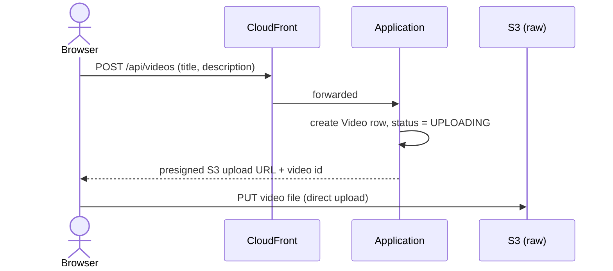
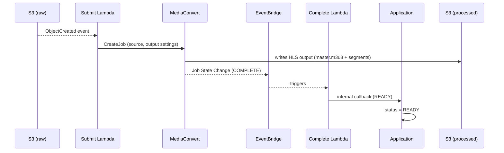
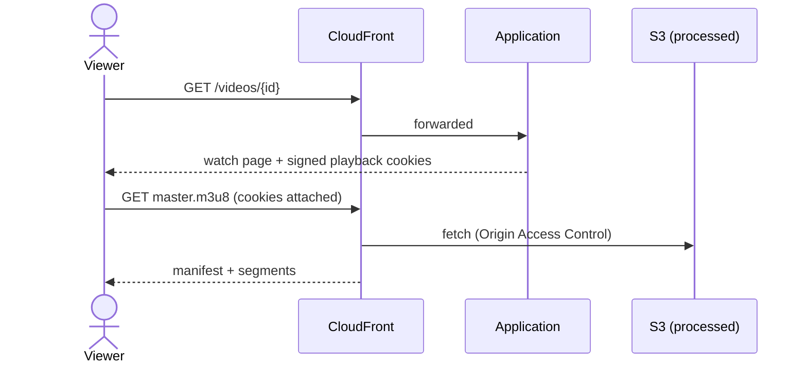

# VOD (Video on Demand)

Upload, transcode, and playback for pre-recorded video. Background: [Protocols, Codecs, and Transcoding](protocols-and-codecs.md), [Data Model](database.md#videos).

## Design principle: the application never touches video bytes

The Spring Boot application's role is limited to issuing URLs and tracking status in MySQL — actual video bytes flow directly between the browser, S3, and MediaConvert. The browser uploads straight to S3 via a presigned URL, and MediaConvert writes its transcoded output straight to S3 without the application ever proxying the data. This keeps the application stateless with respect to bandwidth and lets it stay a single small instance regardless of how large or how many videos move through the platform.

Every request shown below as `Browser`/`Viewer` → `Application` actually passes through CloudFront first — CloudFront proxies the entire application, not just video playback, so the same signed-cookie domain covers both (see [Infrastructure](infrastructure.md)). It's omitted from the diagram lanes below only to keep them readable; every one of these calls is really `Browser → CloudFront → Application`.

## Upload

The application generates the S3 key itself once the row exists (so the key can embed the video's own id), then hands back a time-limited presigned URL scoped to exactly that key. The browser uploads directly to S3 — the file's bytes never pass through the application or CloudFront.

## Transcoding

An S3 upload event triggers a small "submit" Lambda function, which asks MediaConvert to encode the raw upload into H.264/AAC HLS output (see [Protocols, Codecs, and Transcoding](protocols-and-codecs.md)) written directly to the processed S3 bucket. The application itself is never in this path at all — it finds out the result only when MediaConvert's completion event, relayed through EventBridge, reaches a second "complete" Lambda function, which calls back into the application over the internal-only network path (see [Infrastructure](infrastructure.md#event-driven-confirmation)). That callback endpoint has no application-level authentication of its own, because the network path itself — reachable only from that one Lambda — is the actual gate. Both Lambda functions are written to be safely retried: resubmitting an already-processed video is a no-op, and a redelivered completion callback lands on a status transition that only ever applies once.

## Playback

The processed S3 bucket is fully private — nothing is publicly reachable by a bare URL. The watch page, when it renders a `READY` video, sets a small set of CloudFront signed playback cookies scoped to that video's path and a configured expiry; every subsequent request to CloudFront for that video's manifest and segments carries those cookies automatically, since the browser attaches them by domain rather than the application needing to sign each individual request. Without CloudFront configured (local development), playback falls back to a freshly-generated presigned S3 GET URL per request instead.

---

[← Home](../../README.md) · Next: [Live Streaming: RTMP](live-streaming-rtmp.md)
